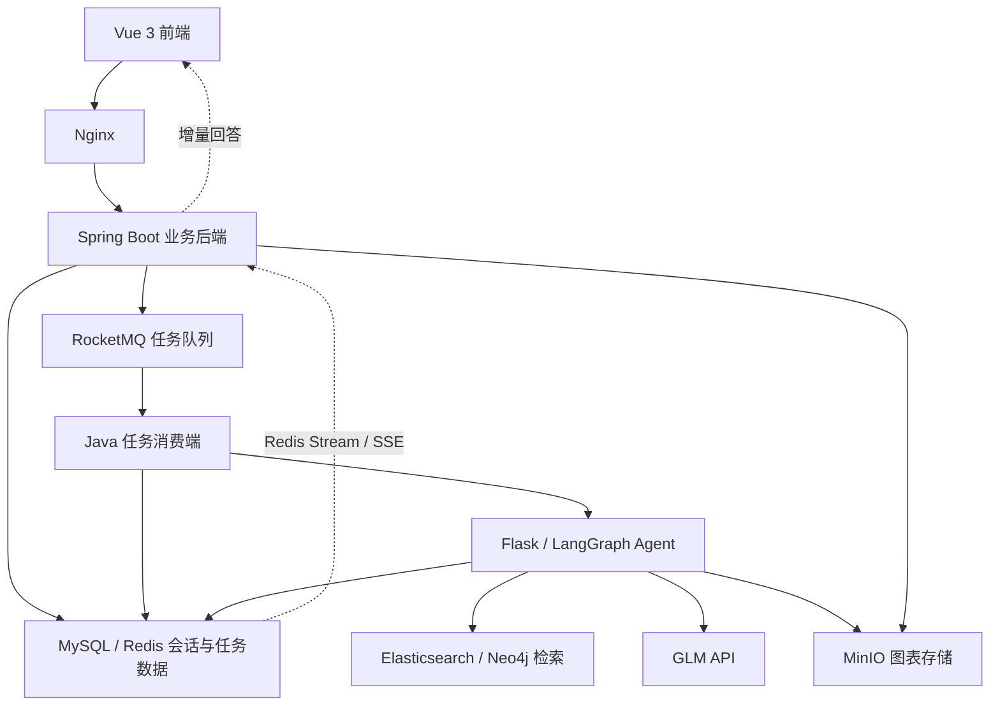

ElectricityLLM
电气工程智能问答系统
ElectricityLLM 是一个面向电力与电气工程资料的全栈智能问答项目，将文档检索、知识图谱、数据绘图与会话记忆整合到同一个聊天入口。
项目采用 Vue 3 + Spring Boot + Flask / LangGraph 架构：Java 后端负责用户、会话、异步任务和结果存储，Python Agent 负责问题分析、技能路由、检索与回答生成，前端通过 SSE 展示增量回答。
技术关键词： RAG · LangGraph · Elasticsearch · BGE-M3 · Neo4j · Redis · RocketMQ · MinIO · QLoRA
项目仓库 · [部署说明](DEPLOYMENT.md) · [数据迁移](MIGRATION.md)
项目介绍
电气工程问题往往同时涉及概念解释、专业文档、设备关系和数值数据。项目围绕这些需求构建了四类回答流程：
- 解释与交流： 完成普通问答、内容改写、总结和说明。
- 资料问答： 从电气工程文档中检索相关片段，将资料作为回答上下文。
- 关系查询： 从知识图谱中查找实体之间的路径，辅助回答设备、部件和概念之间的关联问题。
- 数据分析： 从已整理的结构化数据中检索设备指标，生成图表和文字说明。
连续提问时，系统还会按需读取近期会话、历史摘要和用户信息，对“这个”“之前提到的”等指代进行分析与改写。
核心功能
功能	主要实现
普通对话	通过 GLM API 完成解释、改写、总结等任务
文档 RAG	多字段关键词检索与向量召回，融合候选结果后进行重排
图谱检索	Elasticsearch 实体对齐、Neo4j 多跳路径查询；证据不足时回退文档 RAG
结构化数据绘图	根据设备与指标检索数值数据，使用 Matplotlib 绘图并保存至 MinIO
多轮会话	结合 Redis 短期记忆、MySQL 用户画像与摘要、ES 历史向量检索
流式回答	Python 写入 Redis Stream，Java 通过 SSE 将增量内容传给前端
异步任务	使用 RocketMQ 分发推理任务，维护任务状态、重复投递处理和失败重试
用户与会话管理	注册、登录、Token 校验、会话列表、聊天记录及图表查询

chat、rag、light-rag、plot 是 Agent 内部的技能名称，由问题分析与路由节点选择。检索和绘图结果取决于已导入的资料、知识图谱与结构化数据。
技术栈
层级	技术	职责
前端	Vue 3、TypeScript、Vite	登录与会话界面、聊天记录、流式内容和图表展示
Java 后端	Java 17、Spring Boot、MyBatis	用户与会话接口、任务提交、事务处理、结果持久化
Python Agent	Python、Flask、LangGraph	问题分析、记忆读取、技能路由和子任务编排
文档检索	Elasticsearch、BGE-M3、BGE Reranker	关键词召回、向量检索、候选融合与重排
知识图谱	Neo4j、Cypher	实体关系建模与多跳路径查询
数据与缓存	MySQL、Redis	业务数据、用户信息、历史摘要、缓存、限流、锁与任务状态
异步与流式通信	RocketMQ 5.x、Redis Stream、SSE	推理任务分发、回答事件存储与实时推送
图表与对象存储	Matplotlib、MinIO	图表生成、对象保存和图表访问
模型训练	PyTorch、Transformers、PEFT、TRL	QLoRA、SFT、GRPO 和记忆路由模型实验
工程部署	Docker、Docker Compose、Nginx	服务容器化、反向代理、HTTPS 和持久化挂载

模型分工
用途	模型或组件
在线回答生成	GLM API
路由、问题分析与语义判断	按任务使用不同的 GLM 模型配置
向量编码	BAAI/bge-m3
文本重排	BAAI/bge-reranker-v2-m3
离线领域模型训练	Qwen3-4B 的 SFT / GRPO 实验
离线记忆路由实验	小模型 SFT 与原始模型、融合模型的对比验证

在线服务中的 BGE-M3 和 Reranker 默认使用 CPU；回答生成通过 GLM API 完成。领域模型与小模型训练代码保留在独立的训练、验证目录中。
系统架构

前端统一访问 Java 业务接口。Java 接收问题后提交异步任务，消费端调用 Python Agent；Agent 完成检索与生成，同时写出回答事件。Java 转发事件并保存最终聊天记录、图表元数据。
关键技术设计
1. 多路召回与重排
文档 RAG 同时利用文档名称、章节标题、正文、描述和向量信息，兼顾专业术语匹配与语义相似度。
检索流程包括：
1. 使用 BGE-M3 生成查询向量与关键词信息。
2. 从文档标题、章节标题、正文、描述、正文向量和描述向量等通道召回候选片段。
3. 将归一化分数与 RRF 名次信息进行加权融合。
4. 按 chunk_id 合并重复片段，保留命中的子问题。
5. 使用 BGE Reranker 对查询与候选正文重新评分，选取回答上下文。
对于包含多个明确问题的输入，检索模块分别召回、统一重排，并在最终 Top-K 中兼顾不同子问题。首次检索获得的可用资料较少时，Agent 会改写查询进行二次检索，再合并资料生成回答。
主要代码：[检索入口](ElectricityLLM/ElasticSearch/Search/test.py) · [候选融合](ElectricityLLM/ElasticSearch/Search/HybridSearch.py) · [结果重排](ElectricityLLM/ElasticSearch/Search/reranker.py)
2. 图谱查询与文档检索衔接
light-rag 是项目内部的图谱检索技能，核心流程为：
1. 分析问题中的起点、终点和途经实体。
2. 使用 Elasticsearch 将问题中的实体描述对齐到图谱实体。
3. 使用 Neo4j / Cypher 查询实体之间的多跳路径。
4. 将路径节点与描述组织为关系证据。
5. 判断证据是否足够；不足时切换到普通文档 RAG。
这一设计让关系类问题可以利用图谱路径，同时保留文档检索作为补充证据来源。
主要代码：[图谱查询](ElectricityLLM/LightGraph/GraphGet.py) · [技能编排与回退](ElectricityLLM/Agent/Graph.py)
3. 分层会话记忆
记忆层	存储与内容	作用
近期会话	Redis 中的近期聊天记录	支持连续提问、指代解析和问题改写
用户信息	MySQL 中的用户画像	按需使用专业、兴趣和绘图偏好等信息
历史摘要	MySQL 保存摘要，Redis 缓存，ES 建立摘要索引	压缩较长的历史会话
历史对话检索	Elasticsearch 向量与关键词检索	根据当前问题寻找相关历史内容

Agent 先判断是否需要记忆，再选择读取对应内容。向量历史检索按用户筛选，近期聊天读取按用户与会话组织。
会话记忆的写入与聊天状态关联：
- Java 先提交完整回答与聊天状态。
- 事务提交后调用 Python 的 /memory/index。
- Python 再从 MySQL 读取已完成的聊天，为其建立历史索引。
- 摘要生成时，将最近 5 条已完成对话作为输入，并检查相同对话范围是否已有摘要。
用户画像由独立节点按需更新。会话历史索引以已提交的 COMPLETED 记录为依据，减少将未完成回答写入历史上下文的情况。
主要代码：[记忆读取](ElectricityLLM/Agent/memory.py) · [短期记忆](ElectricityLLM/Agent/skill/short_memory.py) · [向量记忆](ElectricityLLM/Agent/skill/memory_vector.py)
4. 异步推理与流式输出
一次聊天主要经历以下步骤：
1. Java 验证用户与会话，创建 GENERATING 聊天记录。
2. 使用 RocketMQ 提交带有 task_id 的推理任务。
3. 消费端处理任务，调用 Flask / LangGraph。
4. Python 将 start、delta、done、error 事件写入 Redis Stream。
5. Java 读取事件，通过 SSE 推送给前端。
6. Java 将最终结果保存为 COMPLETED；发送失败或达到重试上限的任务记录为 FAILED。
7. 事务提交后更新聊天缓存，并触发会话记忆索引。
系统使用 Redis 维护消费任务状态、重复投递控制与重试计数。流式事件表示生成过程；最终聊天记录的状态由业务持久化流程维护。
前端通过 fetch 读取 SSE 流，携带 Bearer Token，并逐块更新回答内容。
主要代码：[任务消费](llm-back/src/main/java/com/example/llmback/service/rocketService/MessageConsumer.java) · [结果保存](llm-back/src/main/java/com/example/llmback/service/FullService.java) · [SSE 转发](llm-back/src/main/java/com/example/llmback/service/streamSave/RedisStreamLoad.java)
5. 从结构化数据生成图表
绘图技能先分析问题涉及的设备、指标和图表类型，再从 electricity-plot-data 中检索有效数值数据：
- 使用 Matplotlib 生成图表。
- 将图表上传至 MinIO。
- 返回对象存储信息和文字说明。
- Java 保存图表元数据，并提供访问链接供前端展示。
图表依据检索到的数值数据生成，模型负责数据需求分析与图表说明。
主要代码：[绘图组件](ElectricityLLM/Agent/skill/plot.py) · [绘图数据检索](ElectricityLLM/ElasticSearch/Search/PictureSearch.py)
模型训练与验证
仓库保留了领域模型与小模型的训练实验代码：
- 领域 SFT： 围绕 Qwen3-4B 进行监督微调，包含数据读取、质量校验及训练、验证、测试集划分。
- GRPO： 在领域模型基础上进行奖励驱动的优化实验。
- 训练优化： 使用 4-bit QLoRA、梯度累积和梯度检查点降低训练显存开销。
- 记忆路由模型： 训练小模型判断是否读取近期会话、长期用户信息及是否更新用户信息。
- 对比验证： 对原始模型与融合后模型输出进行解析、逐条匹配并保存验证结果。
代码入口	内容
[SFT_training.py](ElectricityLLM/training/SFT_training.py)	领域监督微调
[GRPO_training.py](ElectricityLLM/training/GRPO_training.py)	GRPO 训练
[small_model_training.py](ElectricityLLM/training/small_model_training.py)	小模型记忆路由训练
[memory_routing_verify.py](ElectricityLLM/verify/memory_routing_verify.py)	原始模型与融合模型的记忆路由对比
[sft_score_calculate.py](ElectricityLLM/verify/sft_score_calculate.py)	SFT 回答评分与结果统计

训练数据、模型权重、LoRA 适配器和实验输出需自行准备，不随源码仓库分发。
项目结构
路径	内容
front/	Vue 前端
llm-back/	Spring Boot 业务后端
ElectricityLLM/app.py	Flask 服务入口
ElectricityLLM/Agent/	LangGraph 编排、技能与记忆
ElectricityLLM/AiChat/	GLM 调用与提示词
ElectricityLLM/ElasticSearch/	查询编码、混合检索、重排与索引写入
ElectricityLLM/LightGraph/	图谱实体对齐与路径查询
ElectricityLLM/generate_plot_data/	离线文档分片、数值数据抽取和索引写入工具
ElectricityLLM/document_deal/	文档预处理工具
ElectricityLLM/training/	模型训练实验
ElectricityLLM/verify/	模型验证与评分脚本
deploy/	容器部署配置与数据迁移工具

主要接口
方法	路径	用途
POST	/ai/register	用户注册
POST	/ai/login	登录或校验 Token
GET	/ai/user/sessions	获取用户会话
POST	/ai/user/chat	提交问题，返回任务与会话信息
GET	/ai/user/chat	获取会话聊天记录
GET	/ai/user/chat/stream	订阅任务回答事件
GET	/ai/user/chat/plot	获取聊天关联图表

用户会话与聊天接口使用 Authorization: Bearer <token>。提交问题与订阅回答流分为两个请求，通过 taskId 关联。
部署与数据
服务部署、模型目录、环境变量及数据迁移的具体步骤见：
- [DEPLOYMENT.md](DEPLOYMENT.md)
- [MIGRATION.md](MIGRATION.md)
- deploy.env.example
知识库文档、Elasticsearch 索引、Neo4j 图谱、模型和训练数据需另行准备。当前 Nginx 配置包含 HTTPS，部署时需要设置自己的证书路径。
项目目前以个人工程实践和低并发展示为主要场景。账号密码哈希迁移、会话记忆索引失败后的持久化补偿等机制仍待完善。
